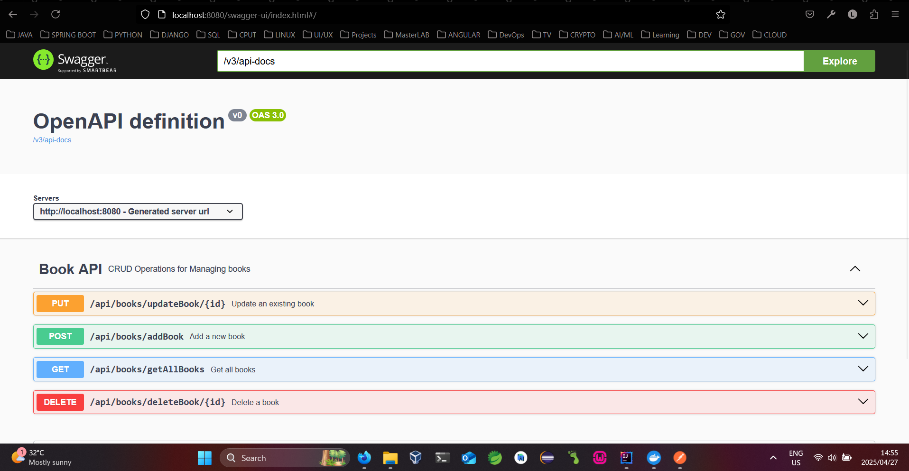

# 📚 Catalogue Management

A Spring Boot application for managing a book catalogue. It allows book collectors to create, update, view, and delete books in their personal library.

---

## 🚀 Project Overview

This repository contains the **Management Service** exposing REST and GraphQL APIs to manage books.

---

## 🛠️ Tech Stack

- Java 17
- Spring Boot 3
- Maven
- H2 In-Memory Database
- GraphQL
- Swagger API Documentation

---

## 📦 Features

- 📖 List all books
- ➕ Add new books
- 📝 Update existing books
- ❌ Delete books
- 📄 Swagger UI for REST API exploration
- ⚡ GraphQL endpoint at `/graphql`

---

## ⚙️ How to Run

### 🧪 Running Locally with Maven

1. **Build and run the project:**
   ```bash
   mvn spring-boot:run
   ```

2. **Or build the JAR and run:**
   ```bash
   mvn clean package
   java -jar target/CatalogueManagement-0.0.1-SNAPSHOT.jar
   ```

## 📖 API Documentation

- **Swagger UI**: Open your browser and go to [http://localhost:8080/swagger-ui/index.html](http://localhost:8080/swagger-ui/index.html)
- **H2 Console**: Available at [http://localhost:8080/h2-console](http://localhost:8080/h2-console)
- **GraphQL Endpoint**: `POST /graphql`

